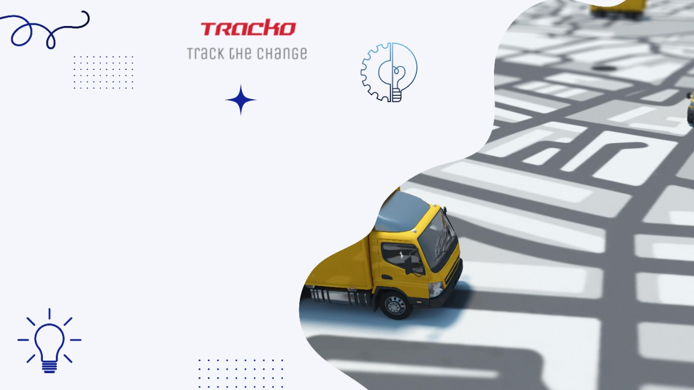
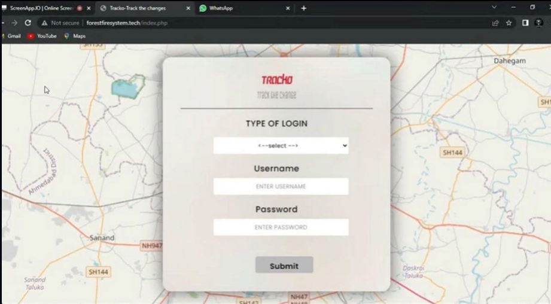

# 🚛 Tracko: Truck Tracking System

## 📌 Project Overview
Tracko is a real-time truck tracking and monitoring system designed to help mining departments and administrators ensure the safe, efficient, and transparent movement of trucks. The system integrates GPS/GSM-based hardware modules with a web-based dashboard, enabling continuous monitoring of truck locations, routes, and activities. It also provides alerts for route deviations, theft attempts, unexpected stops, and connectivity issues, ensuring the security of goods and preventing losses.

---

## 📷 Landing Page


## ❓ Problem Statement
In the mining industry, trucks often transport valuable resources. However, manual monitoring poses several challenges:

- Truck drivers may deviate from assigned routes for theft or personal gain.  
- Instances of goods being stolen or reduced during transit (e.g., dumping forks on roads).  
- Trucks becoming undetectable in low-network areas.  
- Lack of a centralized monitoring system for fleet managers.  

These issues lead to financial losses, safety concerns, and inefficiencies in mining logistics.

---

## ✅ Proposed Solution
Tracko addresses these challenges by combining IoT hardware (GSM module, Arduino, 2G SIM) with a PHP-MySQL web application.

- A GSM module continuously connects to nearby cell towers and sends the truck’s live location.  
- The backend stores and processes location and truck details in a MySQL database.  
- Leaflet JS provides an interactive, real-time map for administrators to track truck movements.  
- The system raises alerts when trucks deviate from predefined routes, stop unexpectedly, or lose connectivity.  
- Both mining administrators and a main admin can monitor fleet performance, while drivers have a dedicated role for journey initiation and updates.

---

## ✨ Key Features
- **Real-Time Location Tracking** – Live GPS/GSM-based tracking of trucks displayed on an interactive Leaflet map.  
- **Alerts & Notifications** – Alerts for unexpected stops, reduced speed, theft suspicion, or undefined route deviations.  
- **Offline Handling** – Stores last known coordinates in the database until connectivity is restored.  
- **Mining Department Integration** – Admins can input truck details (driver info, load details, goods quantity, assigned path).  
- **Interactive Dashboard** – Role-based access (Driver, Mining Admin, Main Admin).  
- **Database-Backed Reports** – Historical tracking for audits and efficiency analysis.

---

## 👥 System Roles
### Driver Role
- Provides journey initiation and updates.  
- Ensures location data is continuously sent via GSM.  

### Mining Admin Role
- Registers truck details, load information, assigned routes, and driver details.  
- Monitors the truck in real-time and receives alerts for issues.  

### Main Admin Role
- Global monitoring of all trucks across multiple mining sites.  
- Manages user access and system-wide reports.  

---

## 🛠️ Technology Stack
- **Frontend:** HTML, CSS, JavaScript  
- **Mapping Library:** Leaflet JS (for interactive maps and live truck tracking)  
- **Backend:** PHP (can also be replaced with **Node.js & Express.js**)  
- **Database:** MySQL (for truck details, coordinates, timestamps)  
- **Hardware:** GSM Module, Arduino, 2G SIM Card  
- **Networking:** GSM Tower-based location tracking  

---

## 🔄 Usage Flow
1. **Login** → Admin logs into the system.  
2. **Truck Registration** → Mining admin fills truck, driver, and goods details with assigned route.  
3. **Real-Time Monitoring** → Live truck location appears on the map with alerts for deviations/issues.  
4. **Notifications** → Alerts sent to admins in case of theft suspicion, undefined route, or disconnection.  
5. **Reporting** → Data stored in MySQL for analysis, audits, and preventive measures.  

---

## 🚀 Installation & Setup
### Prerequisites
- PHP / Node.js installed  
- MySQL database running  
- Arduino IDE (for GSM hardware setup)  

### Steps
```bash
# Clone the repository
git clone https://github.com/your-username/tracko.git

# Navigate into the project
cd tracko

# If using PHP backend
php -S localhost:8000

# If using Node.js & Express.js backend
npm install
npm start
```

---

## 📷 Project Snapshot


---

## 📊 Future Enhancements
- Mobile app for drivers and admins.  
- AI-based predictive alerts for theft and unusual patterns.  
- Integration with cloud platforms for scalability.  
- Support for 4G/5G modules for better connectivity.  

---

## 🤝 Contributing
Contributions are welcome! Please fork this repository and create a pull request.

---

## 📜 License
This project is licensed under the MIT License.


